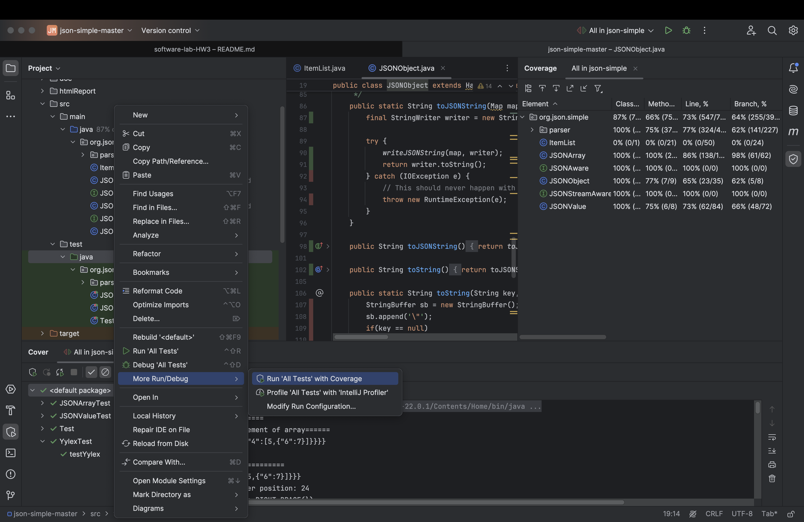

# software-lab-HW3

# پروژه تست پوشش کد

این پروژه به منظور آزمایش و پیاده‌سازی تست‌های واحد و پوشش کد در چارچوب TDD (توسعه مبتنی بر تست) آماده شده است. در این README، نحوه پیاده‌سازی تست پوشش کد و اطلاعات مربوط به ابزارهای استفاده‌شده توضیح داده شده است.

## باز کردن فایل داده شده در Inteliji

## پوشش کد

سپس همانطو که در دستورکار گفته شده بود فایل coverage را به صورت html خروجی میگیریم تا درصد پوشش مشخص شود:

حال همانطور که در دستورکار نشان داده شده بود در با کلیک روی هر فایل کد میتوانیم خط های دارای پوشش(سبز) و سطر هایی که پوشش نداده شده اند را(قرمز) مشاهده کنیم:

## سوال‌ها

1. **مقایسه روش TDD با روش تست سنتی از نظر نوع پروژه‌ها:**

    - **TDD**: این روش به وضوح رویکردی هدفمند دارد. با توجه به اینکه ابتدا تست‌ها نوشته می‌شوند، از ابتدا مشخص است که قرار است چه کارهایی انجام دهیم. این روش از کارهای اضافه و وسواس در کد زدن پیشگیری می‌کند، چرا که ما از ابتدا خواسته‌ها از کد را با تست نوشتن مشخص کرده‌ایم و از طرفی هم کد بهینه‌تر و باکیفیت‌تری داریم. در نتیجه این رویکرد هدفمندانه برای پروژه‌های حساس بزرگ و بلندمدت قابل استفاده است. با توجه به تست‌های اولیه‌ای که نوشتیم و اینکه در راستای آن کدنویسی می‌کنیم، پوشش کد بالایی داریم و به باگ‌های کمتری برمی‌خوریم.

    - **روش سنتی**: در این روش، با توجه به اینکه همان اول کار دست به کد می‌شویم، سرعت بیشتری داریم اما لزوماً کد ما در طولانی‌مدت نیازهایمان را برآورده نخواهد کرد. این روش برای پروژه‌های کوچک و موقت که پایداری کمتری نیاز دارند مناسب است. از طرفی چون خود کد را تغییر می‌دهیم، این روش منعطف‌تر بوده و اگر نیاز به تغییرات سریع در پیشبرد پروژه داشته باشیم، روش سنتی جوابگوی ما خواهد بود.

2. **تست‌ها در فرایند ایجاد نرم‌افزار توسط تیم توسعه و تیم تضمین کیفیت:**

    - **تیم توسعه (Development Team):**
        - تست‌های واحد (Unit Testing): بررسی عملکرد قسمت‌های کوچک و مستقل کد.
        - تست‌های یکپارچگی (Integration Testing): بررسی تعامل بین گروه‌های مختلف کد.

    - **تیم تضمین کیفیت (QA Team):**
        - تست‌های عملکرد (Performance Testing): بررسی رفتار نرم‌افزار تحت بارهای مختلف.
        - تست‌های کارایی (Usability Testing): ارزیابی تجربه کاربری و کاربرپسند بودن نرم‌افزار.
        - تست‌های پذیرش کاربر (User Acceptance Testing): اطمینان از پاسخگویی نرم‌افزار به نیازهای کاربران نهایی.

3. **روال پروژه json-simple برای پروژه فعلی:**

   برای به دست آوردن اعداد پوشش آزمون، بر روی پکیج `java` در مسیر `test` کلیک راست کرده و گزینه **Coverage with Tests All Run** را انتخاب کنید.
   

همانطور که مشاهده می‌کنید پروژه از پوشش خوبی برخوردار است اما در فاز بعدی سعی می‌کنیم این پوشش را حداکثری کنیم.
