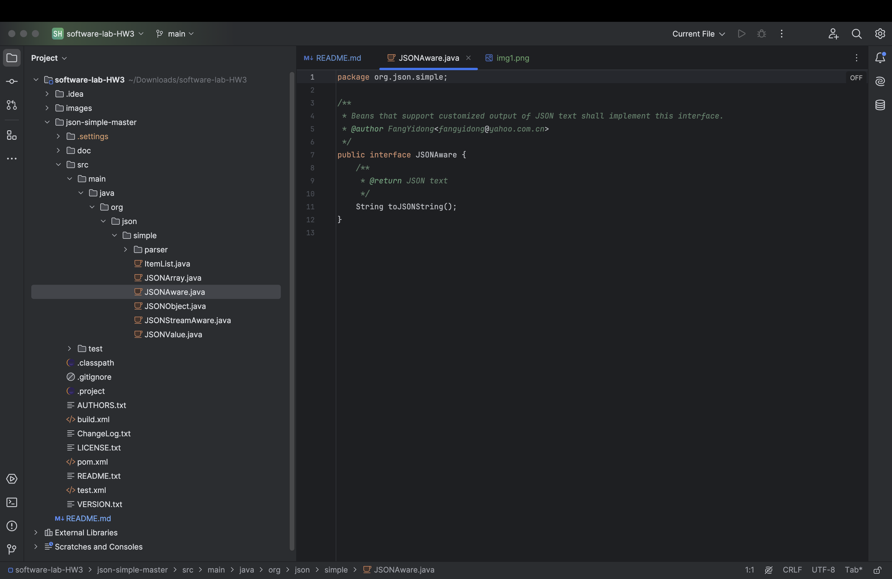
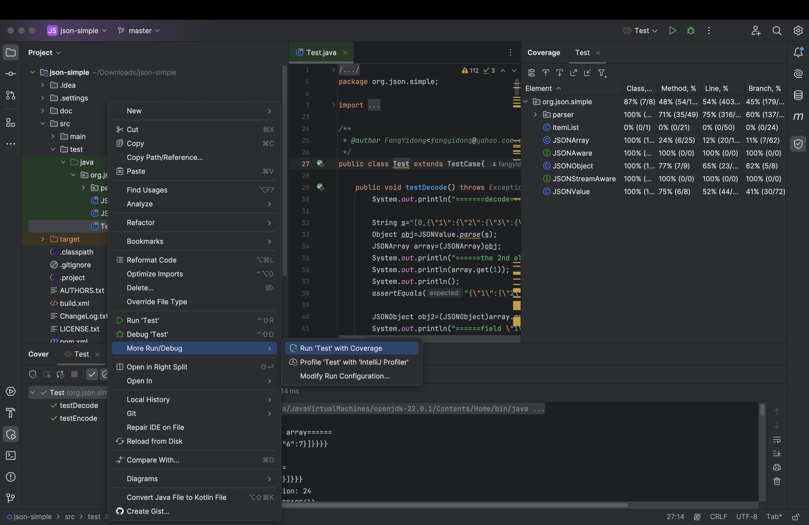
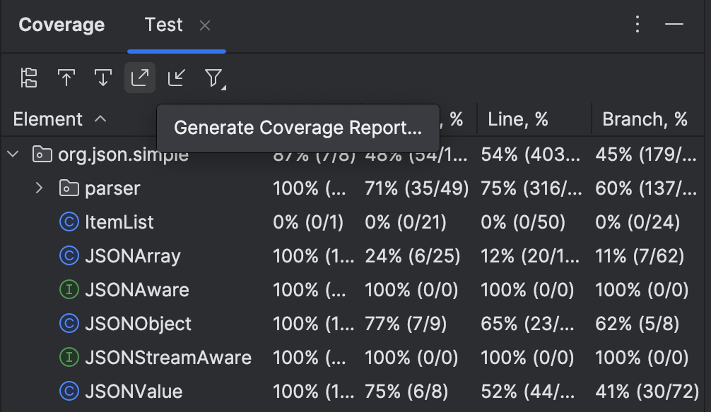
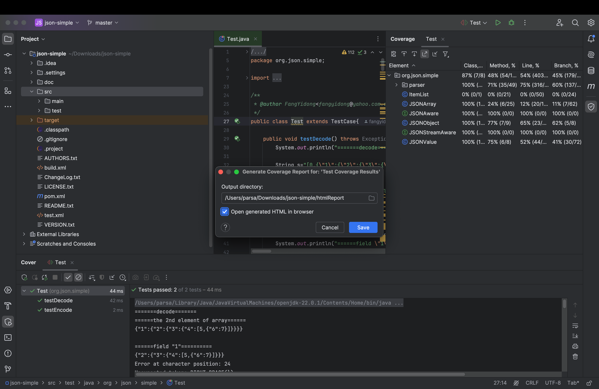
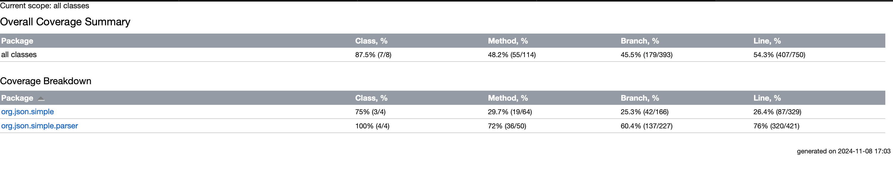
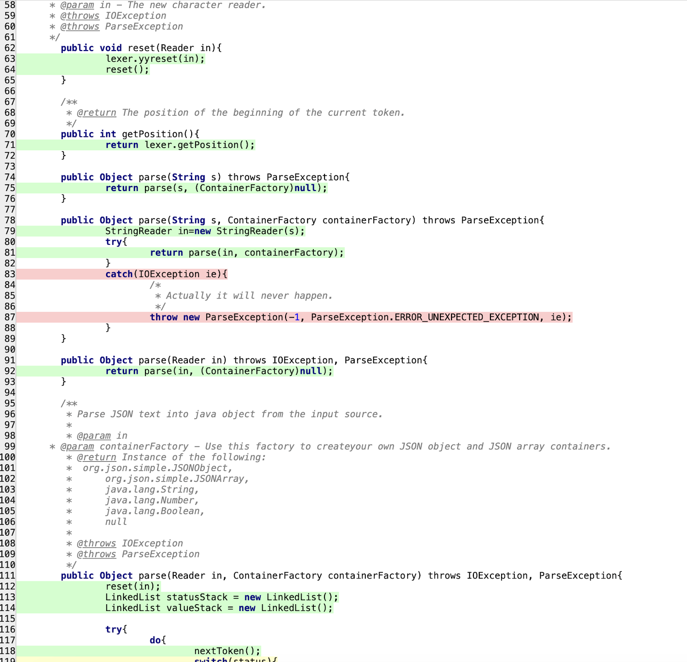

# software-lab-HW3

# پروژه تست پوشش کد

این پروژه به منظور آزمایش و پیاده‌سازی تست‌های واحد و پوشش کد در چارچوب TDD (توسعه مبتنی بر تست) آماده شده است. در این README، نحوه پیاده‌سازی تست پوشش کد و اطلاعات مربوط به ابزارهای استفاده‌شده توضیح داده شده است.

## باز کردن فایل داده شده در Inteliji

## پوشش کد

سپس همانطو که در دستورکار گفته شده بود فایل coverage را به صورت html خروجی میگیریم تا درصد پوشش مشخص شود:

حال همانطور که در دستورکار نشان داده شده بود در با کلیک روی هر فایل کد میتوانیم خط های دارای پوشش(سبز) و سطر هایی که پوشش نداده شده اند را(قرمز) مشاهده کنیم:

